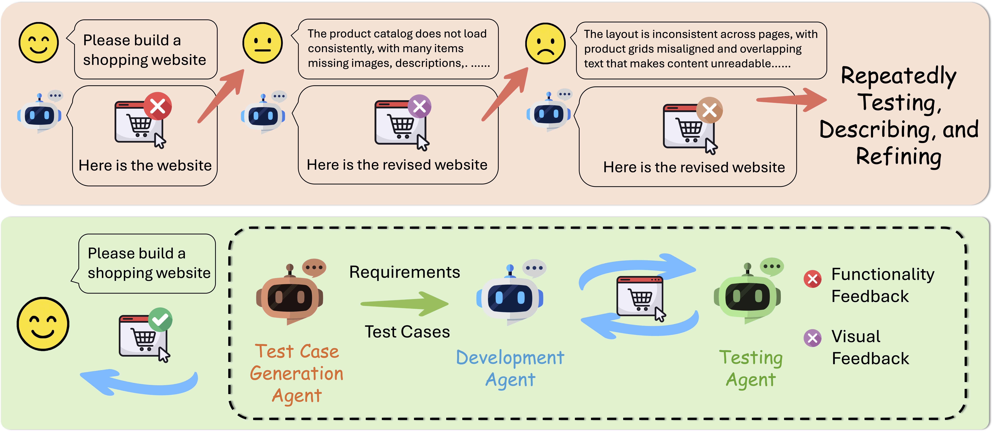

<div align="center">
<h1> Automatically Generating Web Applications from Requirements Via Multi-Agent Test-Driven Development </h1>
</div>
<div align="center">
  
  
</div>

## Abstract
Developing full-stack web applications is complex and time-intensive, demanding proficiency across diverse technologies and frameworks. Although recent advances in multimodal large language models (MLLMs) enable automated webpage generation from visual inputs, current solutions remain limited to front-end tasks and fail to deliver fully functional applications. In this work, we introduce TDDev, the first test-driven development (TDD)-enabled LLM-agent framework for end-to-end full-stack web application generation. Given a natural language description or design image, TDDev automatically derives executable test cases, generates front-end and back-end code, simulates user interactions, and iteratively refines the implementation until all requirements are satisfied. Our framework addresses key challenges in full-stack automation, including underspecified user requirements, complex interdependencies among multiple files, and the need for both functional correctness and visual fidelity. Through extensive experiments on diverse application scenarios, TDDev achieves a 14.4% improvement on overall accuracy compared to state-of-the-art baselines, demonstrating its effectiveness in producing reliable, high-quality web applications without requiring manual intervention. The paper is available at https://arxiv.org/abs/2509.25297.

## Setup and Installation
Note: macOS is currently the only supported OS.
1. **Clone the repository**
2. **Create a conda environment and install Python dependencies:**
    ```bash
   conda create -n TDD python=3.12.11
   conda activate TDD
   pip install -r requirements.txt
    ```
3. **Install Playwright:**
    ```bash
   playwright install chromium --with-deps
   ```
4. **Install Node.js**

   1. Visit the [Node.js Download Page](https://nodejs.org/en/download/)
   2. Download the "LTS" (Long Term Support) version
   3. Run the installer, accepting the default settings
   4. Verify Node.js is properly installed:
        1. Open Terminal
        2. Type this command:
           ```bash
           echo $PATH
           ```
        3. Look for `/usr/local/bin` in the output


5. **Install Package Manager (pnpm)**:

   ```bash
   cd bolt.diy
   npm install -g pnpm
   ```
    If you some permission errors on this step, you may try sudo:
    ```bash
    cd bolt.diy
    sudo npm install -g pnpm
    ```


6. **Install Project Dependencies**:

   ```bash
   pnpm install
   ```

## Configuring API Keys and Providers

Set API keys and base URLs in the `bolt.diy/.env.local` file.
- If you want to use `ChatGPT-4.1`, you need to set the following environment variables:
`OPENAI_API_KEY`
- If you want to use `Claude-4-Sonnet`, you need to set the following environment variables:
`ANTHROPIC_API_KEY`
- If you want to use `Qwen2.5-VL` or `Deepseek-V3.1`, you need to set the following environment variables:
`TOGETHER_API_BASE_URL`,`TOGETHER_API_KEY`

## Start the Application
1. **Start the development agent server:**
   ```bash
   cd bolt.diy
   pnpm run dev
   ```
    - Open the application by accessing the URL shown in the terminal with a local browser
    - **It's strongly suggested to use [Google Chrome Canary](https://www.google.com/chrome/canary/) to access the application.**
    - **You must keep the browser window open throughout development.**
    - Refresh if you encounter a blank page.


2. **Start the client:**
    ```bash
    cd ../client
    python app.py
   ```
   Then, access the client webpage with your browser by accessing the URL shown in the terminal.


